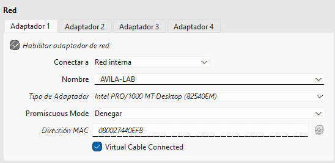

# 01 - Red y virtualización

## Descripción

El laboratorio está construido utilizando VirtualBox y una red interna aislada para simular una infraestructura IT empresarial.

El objetivo de esta fase es crear una red independiente de la red física del equipo anfitrión, permitiendo que las máquinas virtuales se comuniquen entre ellas.

## Arquitectura de red

El equipo físico utiliza la red local `192.168.0.0/24`.

El laboratorio virtual utiliza una red independiente `192.168.10.0/24`, configurada en VirtualBox mediante una red interna denominada `AVILA-LAB`.

```
Red física
192.168.0.0/24
        │
        │
   Equipo físico
   192.168.0.X
        │
        │
     VirtualBox
        │
        │
    AVILA-LAB
192.168.10.0/24
        │
   ┌────┴────┐
   │         │
  DC01    WIN10-01
```

## Configuración de VirtualBox

Las máquinas virtuales utilizan la siguiente red interna:

| Parámetro        | Valor             |
| ---------------- | ----------------- |
| Nombre de la red | `AVILA-LAB`       |
| Tipo de red      | Red interna       |
| Red              | `192.168.10.0/24` |
| Máscara          | `255.255.255.0`   |

El uso de una red interna permite aislar el laboratorio de la red física del equipo anfitrión, manteniendo la comunicación entre las máquinas virtuales conectadas a `AVILA-LAB`.

### Configuración de la red interna en VirtualBox



## Plan de direccionamiento

El direccionamiento previsto para la infraestructura es:

| Equipo         |    Dirección IP | Función                             |
| -------------- | --------------: | ----------------------------------- |
| Gateway futuro |  `192.168.10.1` | pfSense                             |
| DC01           | `192.168.10.10` | Controlador de dominio / DNS / DHCP |
| FILE01         | `192.168.10.20` | Servidor de archivos                |
| LINUX01        | `192.168.10.30` | Servidor Linux                      |
| MON01          | `192.168.10.40` | Monitorización                      |
| SEC01          | `192.168.10.50` | Seguridad                           |
| WIN10-01       |            DHCP | Cliente Windows                     |

Las direcciones destinadas a los servidores de infraestructura quedan fuera del rango DHCP para poder utilizarlas como direcciones estáticas.

### Configuración de red de DC01

La máquina DC01 utiliza la dirección IP estática `192.168.10.10`.


## Rango DHCP

El ámbito DHCP se ha configurado para asignar dinámicamente direcciones dentro del siguiente rango:

```text
192.168.10.100 - 192.168.10.200
```

De esta forma, las primeras direcciones de la red quedan disponibles para servidores, dispositivos de infraestructura y otros elementos que necesiten una dirección IP estática.

## Pruebas de conectividad

Se realizaron pruebas de conectividad mediante ICMP entre las máquinas virtuales.

Por ejemplo:

```cmd
ping 192.168.10.10
```

Las respuestas recibidas confirmaron la comunicación entre el cliente Windows y DC01.


## Resultado

La red interna `AVILA-LAB` se ha creado correctamente y las máquinas virtuales pueden comunicarse utilizando la red `192.168.10.0/24`.

Esta red constituye la base del laboratorio sobre la que se desplegarán posteriormente Active Directory, Windows Server, Linux, servicios de red, monitorización y componentes de seguridad.
