# HOW-TO — AVILA Enterprise IT Infrastructure

Este documento recoge la implementación técnica de la infraestructura actual.

El objetivo es mostrar cómo se ha construido el entorno, las decisiones tomadas durante el despliegue y las pruebas realizadas para comprobar que los servicios funcionan correctamente.

---

## 1. Diseño de la infraestructura

La infraestructura se ha planteado como una pequeña red empresarial aislada, utilizando máquinas virtuales independientes para separar las funciones principales.

La red interna utiliza:

```text
Red:        192.168.10.0/24
Gateway:    192.168.10.1
DNS:        192.168.10.10
Dominio:    avila-tech.local
```

### Equipos

| Equipo   | IP            | Función                      |
| -------- | ------------- | ---------------------------- |
| DC01     | 192.168.10.10 | Active Directory, DNS y DHCP |
| FILE01   | 192.168.10.20 | File Server                  |
| WIN10-01 | DHCP          | Cliente Windows              |

La separación entre `DC01` y `FILE01` permite mantener los servicios de dominio separados del almacenamiento y los recursos compartidos.

---

# 2. Red interna y VirtualBox

La primera parte de la implementación consiste en crear una red interna aislada para que las máquinas virtuales puedan comunicarse entre ellas sin depender de la red física del equipo.

En VirtualBox se crea la red interna:

```text
AVILA-LAB
```

Todas las máquinas que forman parte del laboratorio utilizan esta red.

**Configuración utilizada:**

```text
Red interna: AVILA-LAB
Red IP:      192.168.10.0/24
```

### Configuración inicial de DC01

`DC01` utiliza una dirección IP estática:

```text
IP:        192.168.10.10
Máscara:   255.255.255.0
Gateway:   192.168.10.1
DNS:       192.168.10.10
```

La configuración puede comprobarse mediante:

```powershell
ipconfig
```

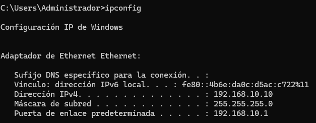

### Comprobación de conectividad

Antes de desplegar los servicios se comprueba que los equipos pueden comunicarse dentro de la red.

```powershell
ping 192.168.10.10
```

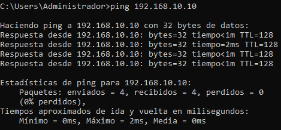

---

# 3. Servicios de infraestructura en DC01

`DC01` centraliza los principales servicios necesarios para que el entorno funcione como una infraestructura de dominio.

Se instalaron:

* Active Directory Domain Services.
* DNS.
* DHCP.

---

## 3.1 DHCP

El servidor DHCP proporciona automáticamente la configuración de red a los clientes.

Se creó el ámbito:

```text
AVILA-LAB
192.168.10.0/24
```

Con un rango destinado a los equipos cliente:

```text
192.168.10.100 - 192.168.10.200
```

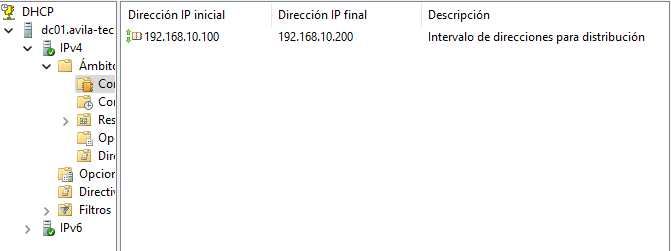

Las opciones principales entregadas a los clientes son:

```text
Gateway:      192.168.10.1
DNS:          192.168.10.10
Dominio DNS:  avila-tech.local
```

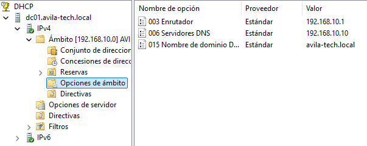

De esta forma, los clientes reciben automáticamente la configuración necesaria para comunicarse con el dominio.

---

## 3.2 DNS

DNS es necesario para la resolución de nombres dentro del dominio.

Durante la configuración de Active Directory se creó la zona:

```text
avila-tech.local
```

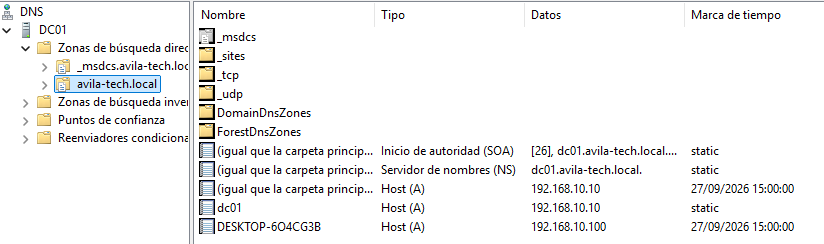

La resolución DNS se utiliza posteriormente para localizar servicios y equipos del dominio.

---

## 3.3 Active Directory Domain Services

Se instaló el rol **Active Directory Domain Services** y se promovió `DC01` como controlador de dominio.

El dominio utilizado es:

```text
avila-tech.local
```

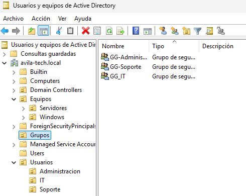

Una vez completada la instalación se realizó una comprobación del estado del controlador:

```powershell
dcdiag
```

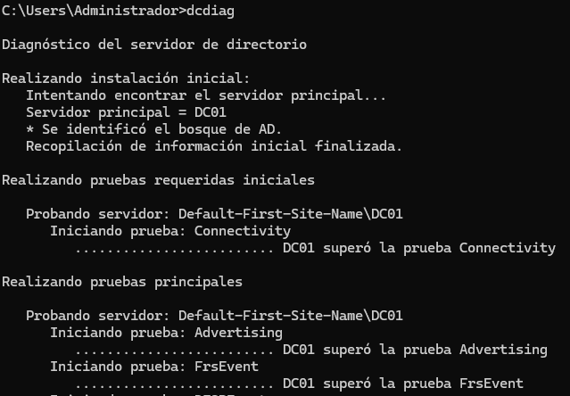

El objetivo de esta comprobación es verificar que los principales componentes del controlador de dominio funcionan correctamente.

---

# 4. Organización de Active Directory

Una vez disponible el dominio, se creó una estructura de OUs para organizar usuarios y equipos según su función.

```text
avila-tech.local
│
├── Usuarios
│   ├── Administracion
│   ├── IT
│   └── Soporte
│
├── Equipos
│   ├── Windows
│   └── Servidores
│
├── Grupos
│
└── Domain Controllers
```

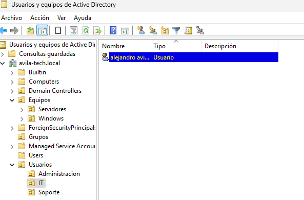

### Usuarios

Se crearon las cuentas necesarias para simular diferentes departamentos:

```text
Alejandro → IT
Manuel    → Soporte
Belen     → Administracion
Valeriano → Usuarios
```

Estas cuentas se utilizan posteriormente para comprobar las políticas y permisos.

### Grupos

Se crearon grupos de seguridad asociados a los departamentos:

```text
GG-IT
GG-Soporte
GG-Administracion
```

La pertenencia de usuarios se utiliza posteriormente para controlar el acceso a los recursos.

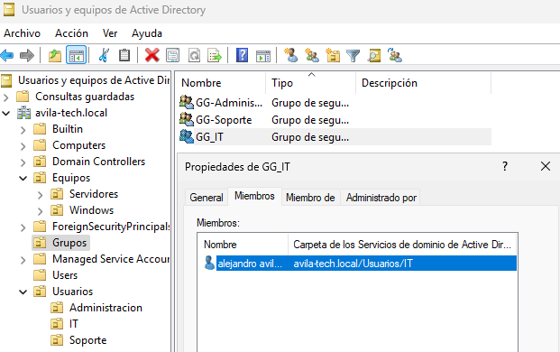

---

# 5. Administración mediante GPO

Para comprobar la administración centralizada se creó una directiva de grupo:

```text
GPO-Soporte-Configuracion
```

La GPO está vinculada a:

```text
Usuarios
└── Soporte
```

La política utilizada como prueba impide que los usuarios de soporte puedan modificar el fondo de escritorio.

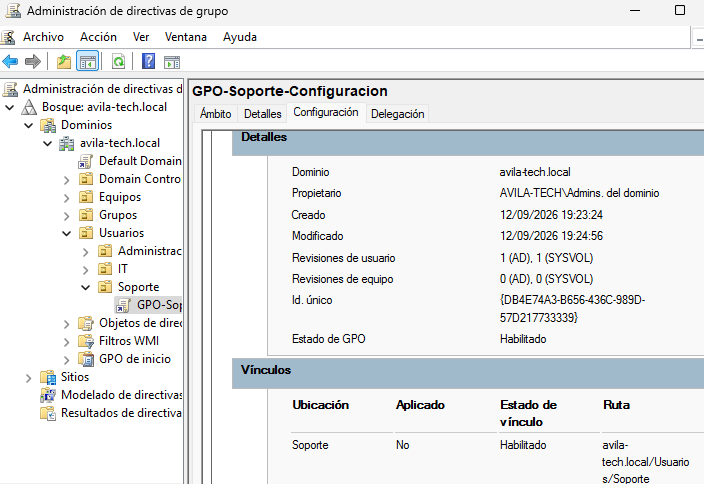

Configuración aplicada:

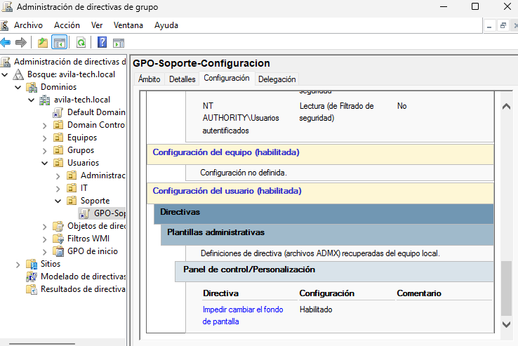

La intención de esta configuración no es únicamente modificar una opción de Windows, sino comprobar el funcionamiento de la administración centralizada mediante Active Directory.

---

# 6. Incorporación de un cliente al dominio

Con los servicios de infraestructura funcionando, se configuró `WIN10-01` como equipo cliente.

El equipo obtiene su configuración de red mediante DHCP y utiliza `DC01` como servidor DNS.

Posteriormente se incorporó al dominio:

```text
avila-tech.local
```

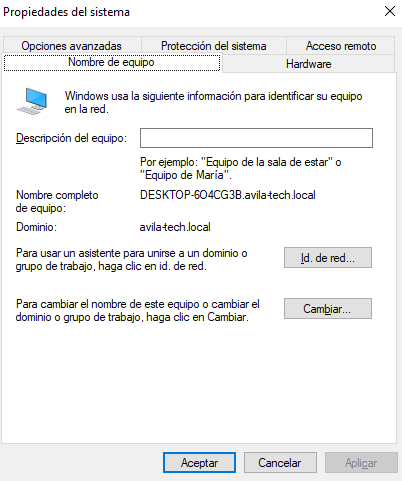

Una vez reiniciado el equipo se realizó una prueba iniciando sesión con un usuario del dominio.

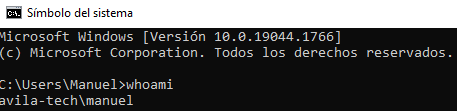

También se utilizaron comandos de comprobación:

```powershell
whoami
gpupdate /force
gpresult /r
```

Estas pruebas permiten comprobar la identidad utilizada y verificar que las políticas de grupo se aplican correctamente.

---

# 7. Servidor de archivos FILE01

Para separar los servicios de dominio del almacenamiento se creó un segundo servidor:

```text
FILE01
192.168.10.20
```

`FILE01` ejecuta Windows Server 2025 y está unido al dominio:

```text
avila-tech.local
```

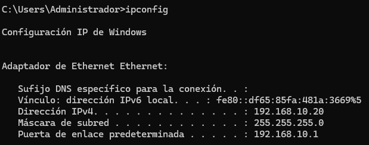


Se instaló el rol **File Server** para proporcionar almacenamiento compartido a los diferentes departamentos.

---

## 7.1 Estructura de carpetas

En `FILE01` se creó:

```text
C:\Departamentos
│
├── IT
├── Soporte
└── Administracion
```

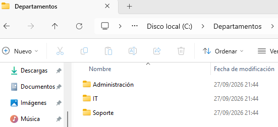

La separación permite aplicar permisos diferentes según el departamento.

---

## 7.2 Permisos NTFS

Los permisos se gestionan mediante los grupos de seguridad de Active Directory.

```text
IT
└── GG-IT → Modify

Soporte
└── GG-Soporte → Modify

Administracion
└── GG-Administracion → Modify
```

Se deshabilitó la herencia en las carpetas departamentales para evitar que permisos generales del directorio superior proporcionasen acceso no deseado.

Se conservaron las entradas necesarias para el funcionamiento del sistema y la administración del servidor.

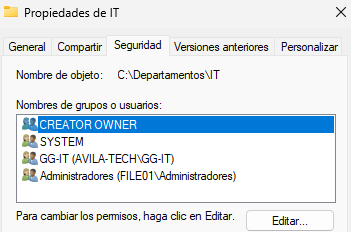

El control de acceso se basa en la pertenencia a grupos, evitando asignar permisos individualmente a cada usuario.

---

## 7.3 Recursos compartidos SMB

Las carpetas se publicaron mediante SMB:

```text
\\FILE01\IT
\\FILE01\Soporte
\\FILE01\Administracion
```

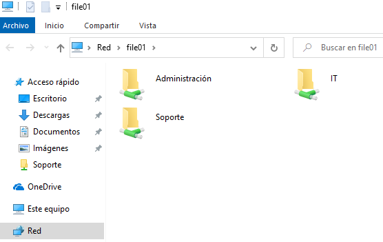

Los permisos efectivos se controlan principalmente mediante NTFS, mientras que SMB proporciona el acceso a los recursos compartidos a través de la red.

---

# 8. Validación del acceso

La configuración se validó desde `WIN10-01` utilizando diferentes usuarios del dominio.

### Alejandro

Pertenece a:

```text
GG-IT
```

Resultado:

```text
IT              ✓
Soporte         ✗
Administracion  ✗
```

### Manuel

Pertenece a:

```text
GG-Soporte
```

Resultado:

```text
IT              ✗
Soporte         ✓
Administracion  ✗
```

### Belen

Pertenece a:

```text
GG-Administracion
```

Resultado:

```text
IT              ✗
Soporte         ✗
Administracion  ✓
```

Estas pruebas permiten comprobar que la estructura de grupos de Active Directory se está utilizando correctamente para controlar el acceso a los recursos del servidor.

---

# 9. Resultado actual

La infraestructura construida hasta este punto dispone de:

```text
                         AVILA-LAB
                      192.168.10.0/24
                             |
          +------------------+------------------+
          |                  |                  |
        DC01               FILE01           WIN10-01
     .10 /24             .20 /24               DHCP
          |                  |                  |
      AD / DNS            SMB / NTFS        Windows
        DHCP                 |                  |
          |                  +--------+---------+
          |                           |
          +------- avila-tech.local ---+
```

Actualmente se ha validado:

* Conectividad de red.
* DHCP.
* Resolución DNS.
* Funcionamiento de Active Directory.
* Organización mediante OUs.
* Usuarios y grupos.
* Aplicación de GPO.
* Unión de equipos al dominio.
* Autenticación de usuarios.
* Recursos SMB.
* Permisos NTFS.
* Control de acceso por departamento.

Esta infraestructura constituye la base sobre la que continuará evolucionando el proyecto.

Las siguientes ampliaciones se incorporarán sobre esta infraestructura, añadiendo nuevas necesidades de red, sistemas, seguridad, monitorización, conectividad entre sedes y servicios cloud.

## 10. FW01 — Gateway, NAT y Firewall

Para proporcionar salida a Internet a la red interna del laboratorio se incorporó un servidor Ubuntu Server como gateway y firewall.

FW01 dispone de dos interfaces de red:

* **WAN (`enp0s3`)**: conectada al adaptador NAT de VirtualBox y utilizada para acceder a Internet.
* **LAN (`enp0s8`)**: conectada a la red interna `AVILA-LAB`, donde se encuentran los servidores y clientes del dominio.

La arquitectura resultante es:

```text
                         INTERNET
                            │
                       VirtualBox NAT
                            │
                    ┌───────────────┐
                    │     FW01      │
                    │ Ubuntu Server │
                    └───────┬───────┘
                       WAN  │  LAN
                   10.0.2.15│192.168.10.1
                            │
                       AVILA-LAB
                    192.168.10.0/24
                            │
              ┌─────────────┼─────────────┐
              │             │             │
            DC01          FILE01       WIN10-01
            .10             .20           .100
```

### 10.1 Conexión de los adaptadores

La interfaz WAN de FW01 utiliza el modo **NAT de VirtualBox**. De esta forma, la máquina virtual puede acceder a Internet utilizando la conectividad del equipo físico.

La segunda interfaz utiliza una **Red interna** denominada `AVILA-LAB`. Esta red está aislada del resto de redes de VirtualBox y constituye la LAN del laboratorio.

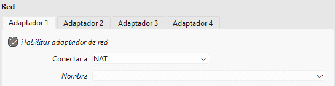

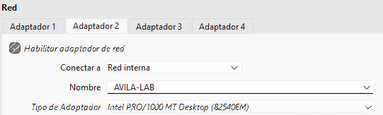

### 10.2 Interfaces de red

Las interfaces de FW01 quedan configuradas de la siguiente manera:

| Interfaz | Red | Dirección         | Función                   |
| -------- | --- | ----------------- | ------------------------- |
| `enp0s3` | WAN | `10.0.2.15`       | Salida hacia Internet     |
| `enp0s8` | LAN | `192.168.10.1/24` | Gateway de la red interna |

La configuración se comprueba mediante:

```bash
ip addr
```

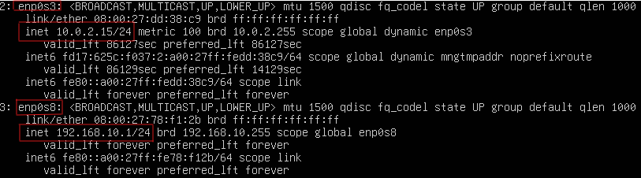

### 10.3 Tabla de routing

FW01 dispone de rutas para ambas redes y una ruta por defecto hacia la red WAN.

```bash
ip route
```

La red `192.168.10.0/24` está asociada a la interfaz LAN, mientras que la ruta por defecto permite enviar el tráfico externo a través de la interfaz WAN.

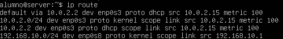

### 10.4 Habilitación del reenvío IP

Para que FW01 pueda actuar como router es necesario habilitar el reenvío de paquetes IPv4.

La configuración se estableció de forma persistente mediante:

```text
net.ipv4.ip_forward=1
```

El estado actual puede comprobarse con:

```bash
sysctl net.ipv4.ip_forward
```

El resultado esperado es:

```text
net.ipv4.ip_forward = 1
```

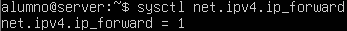

Con esta configuración, FW01 puede recibir tráfico procedente de la LAN y reenviarlo hacia la WAN.

### 10.5 NAT para la salida a Internet

Los equipos de la LAN utilizan direcciones privadas de la red `192.168.10.0/24`. Para permitir su salida a Internet se configuró NAT mediante `MASQUERADE`.

```bash
sudo iptables -t nat -A POSTROUTING -o enp0s3 -j MASQUERADE
```

La regla se aplica al tráfico que abandona FW01 por la interfaz WAN.

```text
WIN10-01
192.168.10.100
      │
      ▼
192.168.10.1
   FW01 LAN
      │
      │ NAT
      ▼
10.0.2.15
   FW01 WAN
      │
      ▼
  INTERNET
```

La regla puede comprobarse mediante:

```bash
sudo iptables -t nat -L POSTROUTING -n -v
```

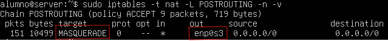

### 10.6 Filtrado del tráfico

Además del routing y NAT, FW01 actúa como firewall mediante `iptables`.

Se estableció una política de **denegación por defecto** para el tráfico que atraviesa el firewall:

```bash
sudo iptables -P FORWARD DROP
```

A partir de esta política se permiten explícitamente las comunicaciones necesarias.

El tráfico iniciado desde la LAN hacia Internet está permitido:

```bash
sudo iptables -A FORWARD -i enp0s8 -o enp0s3 -j ACCEPT
```

Las respuestas procedentes de Internet solo se permiten cuando pertenecen a conexiones ya establecidas:

```bash
sudo iptables -A FORWARD -i enp0s3 -o enp0s8 \
-m conntrack --ctstate ESTABLISHED,RELATED -j ACCEPT
```

De esta forma, FW01 no permite de forma general conexiones iniciadas desde la WAN hacia la red interna.

La configuración actual puede comprobarse mediante:

```bash
sudo iptables -L FORWARD --line-numbers -n
```

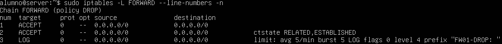

### 10.7 Registro de tráfico bloqueado

Para disponer de visibilidad sobre el tráfico que alcanza la política de denegación se añadió una regla de logging limitada a cinco eventos por minuto:

```bash
sudo iptables -A FORWARD -m limit --limit 5/min -j LOG \
--log-prefix "FW01-DROP: " --log-level 4
```

El límite evita generar una cantidad excesiva de registros en caso de recibir mucho tráfico bloqueado.

Los mensajes generados por `iptables` se gestionan mediante `rsyslog`.

La configuración utilizada es:

```text
:msg,contains,"FW01-DROP:" /var/log/iptables.log
& stop
```

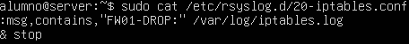

Los eventos registrados pueden consultarse mediante:

```bash
sudo tail -20 /var/log/iptables.log
```

Los registros contienen información útil para identificar el tráfico bloqueado, como:

* Interfaz de entrada y salida.
* Dirección IP de origen.
* Dirección IP de destino.
* Protocolo.
* Puerto de origen y destino.
* Información adicional del paquete.

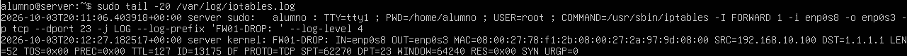

### 10.8 Persistencia de la configuración

Para evitar perder las reglas del firewall después de reiniciar FW01 se utilizó `iptables-persistent`.

La configuración actual se guarda mediante:

```bash
sudo netfilter-persistent save
```

y puede recargarse con:

```bash
sudo netfilter-persistent reload
```

De esta forma, la configuración de NAT y filtrado permanece disponible después de un reinicio del servidor.

### 10.9 Resultado

FW01 actúa actualmente como **gateway, router, dispositivo NAT y firewall** de la infraestructura.

El flujo de salida queda definido de la siguiente manera:

```text
192.168.10.0/24
       │
       ▼
     FW01
       │
  FORWARD
       │
       ▼
      NAT
       │
       ▼
     WAN
       │
       ▼
   INTERNET
```

La política de seguridad sigue el principio de **denegar por defecto y permitir únicamente el tráfico necesario**, mientras que los intentos de tráfico bloqueado quedan registrados para facilitar su análisis.

